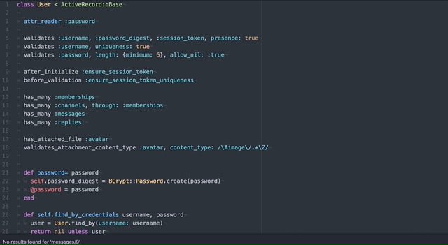
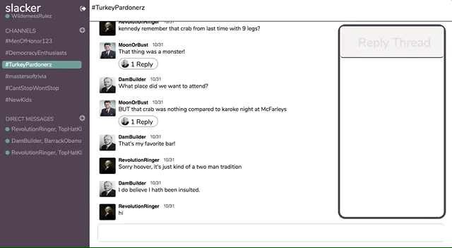
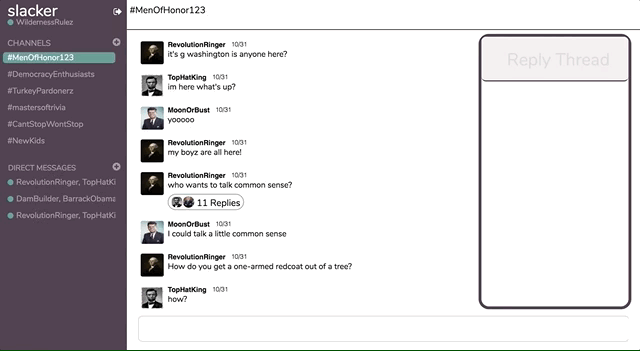
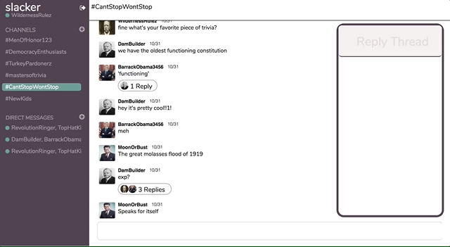

<!-- # Slacker

## README
Slacker is a collaborative live messaging platform inspired by Slack and was built end-to-end in 2 weeks.

Live: https://fullstackslacker.herokuapp.com/#/ (works best in chrome)

## Implementation

Slacker's UI and single-page architecture were built with React.js and Ruby on Rails. Messaging data is stored in a Postgres database, while AWS hosts all user images.

In addition, the app also utilizes the following technologies:

Redux
BCrypt
Pusher
Figaro
Paperclip
jBuilder
react-modal

## Features

The application is composed of the following features.

## Authentication

Slacker has both front-end and back-end authentication. On the backend, Slacker uses BCrypt by hashing user passwords and saving only the encrypted user-data to the database. A cookie storing a hashed token keeps track of the user's current session. If there is not a matching session token then the user is redirected to the login page for authentication.

## Real-time Messaging

The app leverages the Pusher API in order to maintain a WebSocket and TCP-based protocol connection. These enable bi-directional communication between the server and the client.

When a client selects a channel to view, they become subscribed to a unique connection through pusher. The connections means that they are subscribed for any update to the channel.

## Channels

Slacker allows users to create public channels by entering a name and then selecting the users they wish to be in the channel. Channels are accessible by any user.

## Direct Messages

Slacker allows users to create private channels by simply selecting the users they wish to be in their channel. Unlike public channels these are not accessible by any user.

## Future Production

Slacker will always be improving. The next features I plan to implement are:

1. Notifications
2. Channel Search
3. Emoticons -->

# Slacker

[LIVE](https://fullstackslacker.herokuapp.com/)

  

Slacker is a web application inspired by a well-known communication app, Slack. The application is meant to have the same comfortable feel and functionality of Slack with a few personal touches to make the application more fun.

## Features and implementation

Slacker's UI and single-page architecture were built with React.js and Ruby on Rails. Messaging data is stored in a Postgres database, while AWS hosts all user images.

In addition, the app also utilizes the following technologies:

Redux
BCrypt
Pusher
Figaro
Paperclip
jBuilder
react-modal

To provide most sensible explanation of what Slick is capable of, its features  will be described in the following order:
1. [Users](#users)
2. [Channels and Subscriptions](#channels-and-subscriptions)
3. [Messages](#messages)
4. [Live Chat](#live-chat)
5. [Replies](#replies)
6. [Responsiveness](#responsiveness)

## Users

  
  

Slacker allows users to Sign Up and Log in using intuitive modals on the splash page. The application has front end and back end authorization to safely store the password for old and new users. On the backend, the password is put through a hashing function and stored in the database under 'password_digest'. When a user then goes to sign in, the password is put through the same hashing function (BCrpyt) and if the two password_digests are equal the user will be logged in. Upon logging in, the users session_token is attached to the browser so that the user can refresh the page and not have to tediously log in another time.

## Channels and Subscriptions

  

On Slacker, the demo accounts (George Washington and Theodore Roosevelt) begin with memberships to several channels in addition to the ability to create more. Because users have many channels and channels have many users I employed a through table called 'Memberships' to handle the relationship of channels and users. Upon creating a channel, the selected users will have a 'Membership' created with that specific channel.   

There are two types of channels in Slick - private, public. The difference between private and public is that all users can see public chat, but they cannot see private chats. Then, the difference between private chats and direct messages is that users do not have to go through naming and describing them.

Channels and Direct Message are created in the left column of the application. Upon clicking the plus sign, a modal will appear showing the names of every user in the database. The user can click the the names of the users they would like in the new channel or direct message.  

## Messages

  

Messages are created when the user submits content in the most bottom part of middle column. Upon submitting, the message is immediately displayed and the bottom of the chat will come into screen. Messages are stored in the database and only called upon the clicking of the channel they belong to. This keeps the initial rendering of the application quick.  

## Live Chat

  

Live chat is available using the pusher api. When a message is sent and validated on the on the backend, pusher's 'trigger' method is called with the event 'message_published' and the specific channel's id with which it was saved. The channels, which listening for 'message_published', will fetch the new message when this event is received.

Using the publish and subscribe model users enjoy live group chat in all channels where they have a membership.

## Replies

In addition to responding to messages in the channel, users can directly respond to messages in the reply thread. When messages are sent to the frontend using jBuilder, they hold their replies as an object in the state. This allows for fast look up on the frontend.

## Responsiveness

The width of browser determines how long, how big, and which of the elements will appear on the application. By using media queries, the messages and replies adjust so that the content of each can be seen in any circumstance.

## Future Directions for the Project

As for future directions, following are desired features for Slick:

1. Persisting emoticon data
2. Notifications  
